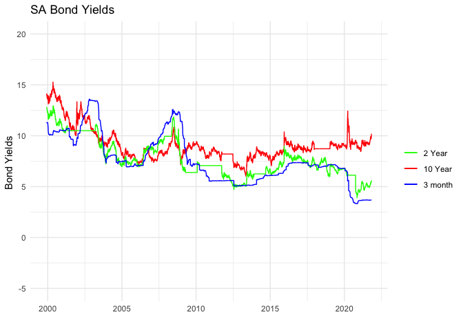
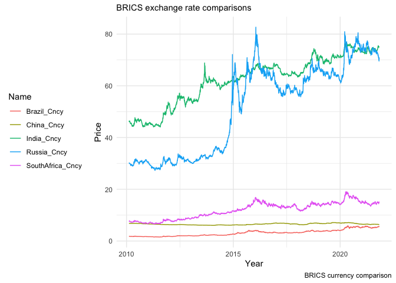
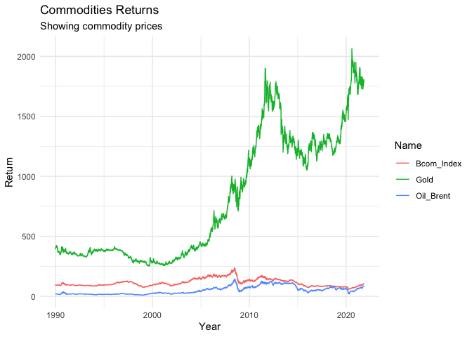
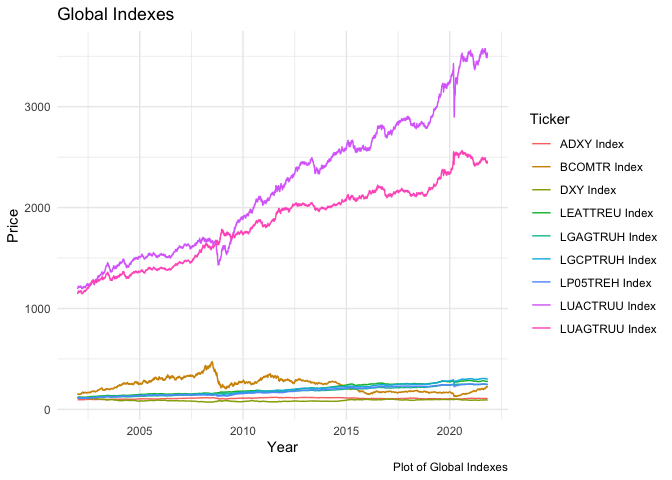

README
================
20903936
12/4/2021

``` r
#rm(list=ls())  # clear all variables in current environment
#graphics.off() # clear all plots
```

# Introduction

This README presents the answers for the Financial Econometrics Paper
2021. The paper consisted of 6 questions. Below, approaches to answering
the questions as well as key plots and functions will be presented.

#Question 1

This question was interesting because it tapped into key concepts in
finance. Yield spreads are financial indicators that tell investors the
likelihood of a recession or a recovery in a market. To calculate a
yield spread, one can take any longer-term dated bond yield and subtract
the shorter term dated bond yield. When analyzing yield spreads, the
investor observes the yield spreads and can see if an economy is heading
for recession or recovery. When spreads increase, this signifies an
increase in risky bond securities being offered to the market to
compensate for risks in an economy. As spreads decrease, this usually
indicates that an economy is in recovery and fewer rates.

The first thing to do was to load all my packages and data necessary.
These included the following code:

After this was done, I observed the data by making use of ggplot where I
tried to look at the bond yields and called the graph “g”. The code is
below:

``` r
g
```

<!-- -->

Next I showed the USE/ZAR level because often then yield spreads
increase, exchange rates strengthen. This is usually because of global
investor chasing after high yields. As was seen, there seemed to be a
strengthening of the rand during the period under investigation.
However, it must be said that there could have been other factors
influencing the rand at the time.

I then had a look at the yield spreads of the 10 year. The difference
between the 2 year and the 10 year are often used as a proxy for risk in
an economy. Thus I followed convention. Indeed, bond yields have been
going up, corroberating with the economists assertions.

I tried to compare the US 10 year yield spreads with that of the South
African yield spread. It also showed an uptick. This I concluded was the
as a result of the covid 19 pandemic and its global impact.

I must admit, if I had more time and I would have had a look deepr at
the volatility proxies such as the VIX and VEEM. Even though they were
in the document. I think there is much more to be done in understanding
the how the proxies have changed over time and whether they are any
difference in the way they behave to see if there is any inherent added
risk in emerging markets.

# Question 2

In question two, I had to compare the methodologies of two indices the
J200 and J400.

This one require a bit of exploratory data analysis as I had to ensure
that the returns where appropriate (i.e simple returns) and that the
portfolio returns where distributed appropriately (i.e log normal). I
also had to ensure that the J200 and J400 always summed to 1 every time
their weights changed per day.

I found that the J200 has more stable returns for industrial. But the
J400 has more stable returns for resources.

The tough part was capping the index. This was very tough. I tried to
use the code from class. I tried to make the take just the re balance
days out and then tried to link it to my data set so that I can then try
and get the weights to re balance on those days. It was a bit of a mess.
I had to move on because time was pressing.

# Question 3

Another very interesting question. Here the JSE wanted to know the
concentration and commonality of returns within the Top 40 index (J200).
In this question I used the code from class, especially the PCA code and
the stratification class.

In this question I first had to stratify my data to only have high
volatility periods only. then I did a PCA analysis on the high
volatility parts to show the componants that describe where the sources
of returns come from during volatile periods. I feel like I could have
done more with this one. The value that one can derive from
understanding the sources of returns during high volatility periods is
enormous. Definately a technique I will be using in future.

At the end of my analysis I found that in the skree plot , the elbow of
the plot is at 2. This meant that there were 2 components in the high
volatility periods that can explain the sources of returns. But I must
admit, I needed to go deeper into what the elbow meant. Often times its
about 80% of the data being explained by 2 componants but I just could
say here. I tried to used the summary functions however I had about 81
variables. In the end I tried what I can and had to move on
unfortunately.

# Question 4

This question was more about plotting in my humble opinion. In this
question I made use on an interesting tool called essquisser to comment
on the two statements below.

-   The South African rand (ZAR) has over the past few years been one of
    the most volatile currencies;
-   The ZAR has generally performed well during periods where G10
    currency carry trades have been favorable and these currency
    valuations relatively cheap. Globally, it has been one of the
    currencies that most benefit during periods where the Dollar is
    comparatively strong, indicating a risk-on sentiment.

``` r
c
```

<!-- -->

In the above plot I show that the South Africa rand has been quite
volatile over the last few years. This is due to various factors. For
instance, in recent time Covid 19 has contributed to volatility.
Furthermore, the July riots also contributed to recent volatility.

The second question was answered with a rather ambiguous plot. I tried
to normalised the axis so that I can try comment on the second point in
the question. I found that the results seemed ambiguous. It almost looks
like there is a negative correlation between the two series. So I cannot
be sure if indeed there is an inverse relationship between the two
series. It would be usefuly to plot a corelation plot but a part of me
feels like there is more to these returns than meets the eye.

# Question 5

This section dealt with the notion that returns are converging across
asset classes. To illustrate this idea, I am tasked to show the
following.

-   Show how these co movements have increased in the past decade;
-   Show to what extent these return profiles have homogenized by
    considering the commonality of the sources of returns over time.
-   In your answer, be creative in using visual and statistical measures
    to convey the issue of how co-movement have changed over time.

To illustrate the above, I used China as a country which has an Index,
bond Yields and compared these to the return on gold. I show that there
does seem to be a convergence between bond yields, gold returns and MSCI
China returns. This I argue is likely due to the move towards crypto
currencies or even cash by investors as risk has increased due to Covid
19 pandemic.

However, gold has been on an upward trend in the long run. Which is also
known as a indicator of investors running for safety. So then, this
could also emphasize the risk off environment that has result in the
downwards convergence of the Chinese asset securities under analysis.

``` r
g200
```

<!-- -->

# Question 6

``` r
pacman::p_load("tidyr", "tbl2xts","devtools","lubridate", "readr", "PerformanceAnalytics", "ggplot2", "dplyr","tidyverse","xts","timeSeries","fPortfolio","quantmod")

MAA<-readRDS("/Users/mathlogonolomashitisho/Desktop/Economics Masters /Semester 2/Fin Metrics/Financial Econometrics Practical/data/MAA.rds", refhook = NULL) %>% select(date,Ticker,Price)

#msci <-readRDS("/Users/mathlogonolomashitisho/Desktop/Economics Masters /Semester 2/Fin Metrics/Financial Econometrics Practical/data/msci.rds", refhook = NULL)  %>% filter(Name %in% c("MSCI_ACWI", "MSCI_USA", "MSCI_RE", "MSCI_Jap"))
```

This last question had to do with portfolio construction. Here we had to
build a balanced fund using the following criteria:

-   Long-only strategy
-   When using covariance and mean forecasts, use a look-back of less
    than 3 years;
-   Do not hold any assets with less than 3 years’ returns data;
-   Apply Quarterly Rebalancing;
-   Limit exposure to Bonds and credit instruments at 25%;
-   Limit exposure to Equities at 60%;
-   Limit single asset exposure at 40%;

I started out by trying to do some exploratory data analysis to
understand the underlying data analysis and ended up being able to bind
the two msci and MAA data sets. However, the msci data set was giving me
trouble. In the end I had to try clean up the other questions as it was
getting late. I should have started here.

The below graph was an effort to try continue with some EDA given the
above.

``` r
g1000
```

<!-- -->
